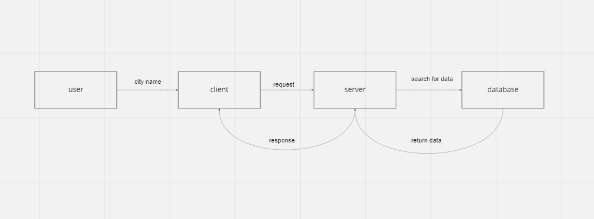

# city-explorer-api

**Author**: Ahmad
**Version**: 1.0.0

## Overview

Create a REST API for the city explorer app.

## Getting Started

    1. Clone the repository
    2. Install dependencies
    3. Run the server
    4. Open the browser and navigate to http://localhost:3004

## Architecture

Create a REST API for the city explorer app.
express.js is used to create the server.
cors is used to allow cross-origin requests.
dotenv is used to load environment variables.

## Change Log

02-08-20022 4:59pm - The API is now running on port 3004.

## Credit and Collaborations

This project was created by Ahmad Jubran.

[Fawzi Shiyyab](https://github.com/fawzi-shiyyab19) helped me with the map.

## Map

## feature 1

Name of feature: **Set up your React repository & API keys**

Estimate of time needed to complete: **20 minutes**

Start time: **08:40 PM**

Finish time: **09:00 PM**

Actual time needed to complete: **20 minutes**

## feature 2

Name of feature: **Weather (placeholder)**

Estimate of time needed to complete: **2 hour**

Start time: **09:00 PM**

Finish time: **04:00 PM**

Actual time needed to complete: **4 hour**

## feature 3

Name of feature: **Map (placeholder)**

Estimate of time needed to complete: **1 hour**

Start time: **04:00 PM**

Finish time: **05:00 PM**

Actual time needed to complete: **1 hour**
